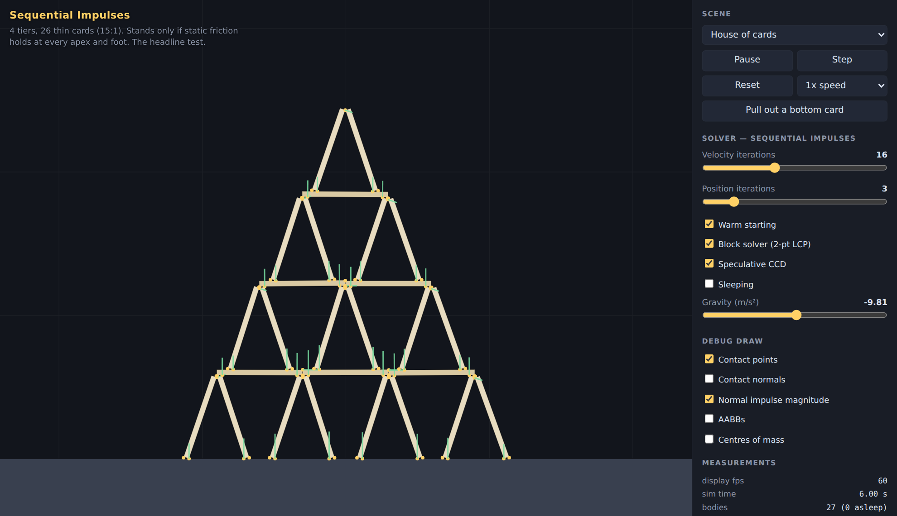
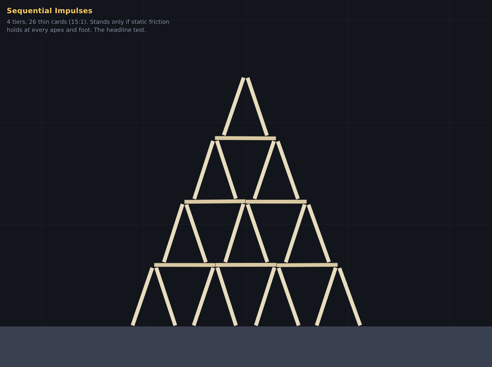
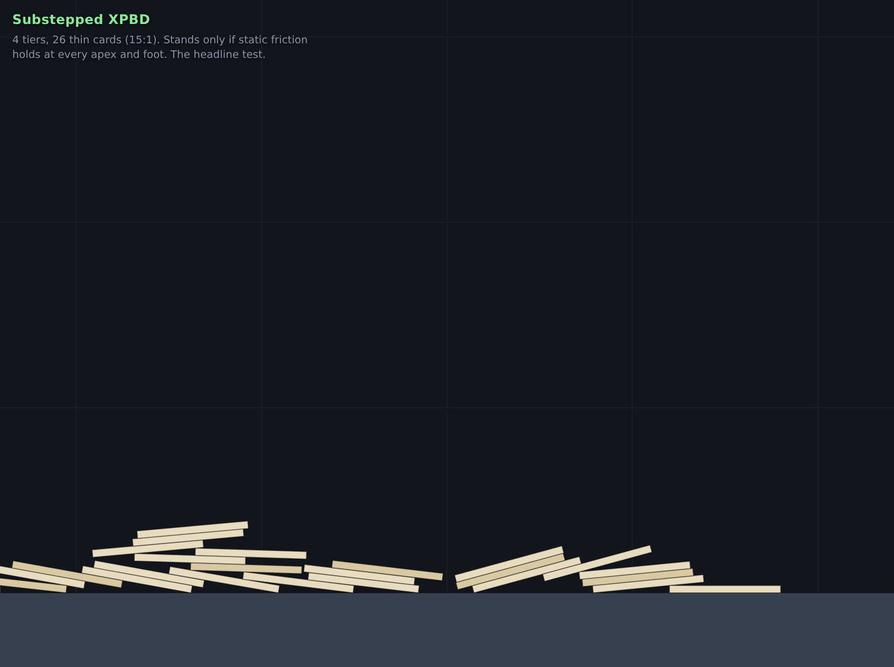
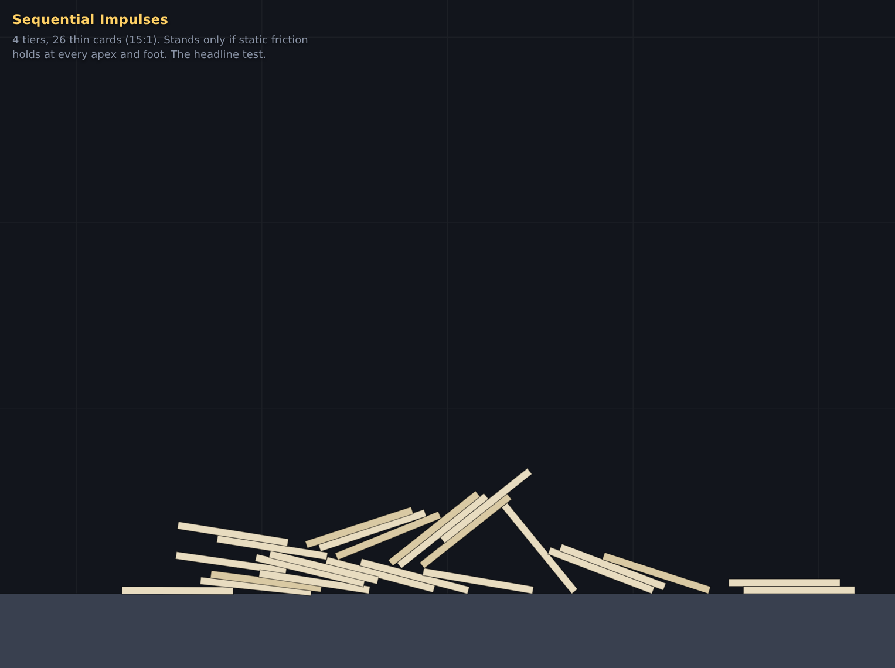
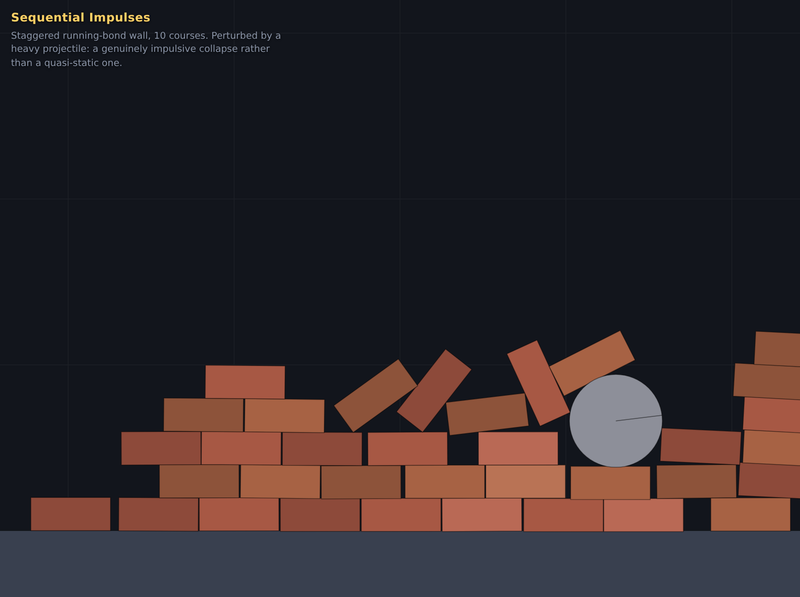

# Two 2D rigid body physics engines in JavaScript

An investigation into how to build a 2D rigid body engine in JavaScript, which
approach to pick, and what the trade-offs actually cost — measured rather than
asserted.

Two engines were built to production quality and shipped as **self-contained
client-side HTML pages** with no dependencies, no build step at runtime, and no
network access:

| page | approach |
|---|---|
| [`dist/sequential-impulses.html`](dist/sequential-impulses.html) | Sequential impulses — projected Gauss–Seidel on the velocity-level LCP (the Box2D / Erin Catto formulation) |
| [`dist/xpbd.html`](dist/xpbd.html) | Substepped XPBD — extended position-based dynamics after Müller et al., SCA 2020 |

Open either file in a browser. Both run the **same eight demo scenes** built
from the same seeded generator, share the same collision detection, renderer and
instrumentation, and differ *only* in the solver file. Any difference you see is
the solver.



---

## 1. Choosing the two approaches

The requirement — simulate a house of cards, and a rigid structure collapsing
when it becomes unstable — is what selects the approach. Bouncing a ball is easy;
the discriminating workload here is **persistent resting contact in a large
coupled contact graph, with dry friction that genuinely holds, on thin bodies, in
marginal equilibrium**. The structure must stand indefinitely *and* fall over
convincingly when disturbed. Anything that buys stability with heavy damping or
position snapping gets the first half and fails the second.

Seven families were considered (full reasoning in [`notes.md`](notes.md)):

| approach | verdict |
|---|---|
| **Penalty / soft contacts** (spring-damper) | Rejected. Stiffness needed for a card tower grows with stack height, and explicit integration then needs a tiny `dt`. Visibly spongy. |
| **Global LCP with a direct solver** (Dantzig/Lemke) | Rejected. Accurate but O(n³)-ish, brittle on the redundant contact sets a symmetric card structure produces, and friction needs a cone approximation plus an outer iteration. Implementation risk far exceeds the value. |
| **Sequential impulses (PGS)** | **Selected.** The industry default for 2D precisely because it stacks. |
| **Substepped XPBD** | **Selected.** The strongest modern alternative; handles friction at the position level, which is exactly what a card apex needs. |
| **Verlet particles + distance constraints** | Rejected. Bodies only approximately rigid; thin boxes built from 4 particles wobble; friction is a hack. |
| **Featherstone / reduced coordinates** | Rejected. Solves articulated joints; here all coupling is unilateral contact. |
| **Speculative / continuous collision** | Not a solver family. Folded into both engines as a feature. |

The two selected approaches are the genuinely dominant modern answers, and
critically **they fail in different ways**, which is what makes the comparison
worth running.

## 2. What is shared, and what is not

To make the comparison honest, everything except the solver is byte-identical:

```
src/core/math.js        vectors, seeded RNG
src/core/body.js        bodies, convex polygons/circles, mass properties     SHARED
src/core/collide.js     SAT + Sutherland-Hodgman clipping, 2-point manifolds SHARED
src/core/broadphase.js  sweep-and-prune                                      SHARED
src/core/sleep.js       island detection via union-find, sleeping            SHARED
src/scenes.js           the eight demo scenes, seeded                        SHARED
src/app/                canvas renderer, UI harness, HUD                     SHARED
src/metrics.js          measurements                                         SHARED

src/engines/si.js       sequential impulses          <-- the only difference
src/engines/xpbd.js     substepped XPBD              <-- the only difference
```

Both engines expose the same `World` API (`addBody`, `removeBody`, `step(dt)`,
`bodies`, `stats`, `debugContacts`), so the harness never knows which it is
driving. Sources are ES modules so Node can import them for headless testing;
[`build.js`](build.js) strips the module syntax and inlines everything into the
two standalone pages.

### Approach 1 — sequential impulses ([`src/engines/si.js`](src/engines/si.js))

Per step: integrate velocities → prepare constraints and warm-start from the
previous frame's cached impulses → *N* velocity iterations applying corrective
impulses point by point with **accumulated-impulse clamping** (the clamp is what
makes it a projected Gauss–Seidel on the LCP rather than a naive impulse loop) →
a separate restitution pass → integrate positions → *M* iterations of non-linear
Gauss–Seidel position correction that re-evaluates the geometry each time and
leaves velocities untouched.

Three details do the heavy lifting: **warm starting** (contact impulses persist
across frames keyed by SAT feature ID, so the solver starts from last frame's
answer), the **block solver** (a 2-point manifold is solved as a coupled 2×2 LCP
with all four active-set cases, so a box resting on a box does not rock between
its corners), and **speculative contacts** with the constraint `vₙ ≥ −s/dt`.

### Approach 2 — substepped XPBD ([`src/engines/xpbd.js`](src/engines/xpbd.js))

Per substep (`h = dt/substeps`): save pose → `v += h·g` → integrate the pose
explicitly → build contacts → project **positions** (non-penetration, then static
friction) → recover velocity as `v = (x − x_prev)/h` → a velocity pass for
dynamic friction and restitution.

The paper's central claim is that *N* substeps × 1 iteration beats 1 step × *N*
iterations. Static friction is applied positionally — "undo the tangential slip
that occurred during this substep, subject to `λ_t ≤ μ_s λ_n`" — which pins
contacts rather than merely damping their relative velocity.

One deviation from the paper: a **maximum recovery speed**, clamped to
`max(3 m/s, |approach speed|)`. XPBD converts every positional correction
directly into velocity, so a body that starts 40 mm inside another is ejected at
`0.040/h` = 29 m/s. The clamp is inert for resting contacts (per-substep depth is
`~g·h²`) and never damps a genuine impact. This is standard in production XPBD
implementations.

## 3. The demo scenes

All eight are identical across both pages and deterministic (verified by state
hashing — see §6).

| scene | what it tests |
|---|---|
| **House of cards** | 4 tiers, 26 thin cards (15:1). The headline test. |
| **House of cards (6 tiers)** | 66 cards. Deliberately past both engines' reach at interactive cost. |
| **Box tower** | 13 boxes, 1.5 mm placement error — just inside the toppling height. Lean drift. |
| **Box pyramid** | 78 boxes, wide redundant contact graph. Gauss–Seidel ordering artefacts. |
| **Dominoes** | 24 thin dominoes + trigger. Impulse propagation through a collapse wave. |
| **Brick wall** | 10 courses + wrecking ball. Genuinely impulsive collapse. |
| **Corbel arch** | Blocks held only by friction and the weight above. |
| **Friction ramp** | Analytic validation: μ = 0.20/0.40/0.60/0.80 on 25°. |

### On the card geometry

A real playing card is ~89 mm × 0.3 mm — a 300:1 aspect ratio that no rigid body
engine handles. The cards here are 600 × 40 mm, **15:1**, which is an honest
"thin plank" compromise and already thin enough to expose solver problems. The
structure is built the way a real one is: A-frames leaning at 18° with a small
apex gap so the pair *settles* into contact, and one flat card per bay whose ends
rest just inboard of two adjacent apexes, so every apex carries two card ends and
each A-frame is loaded symmetrically. Bay spacing is pinned to the card length by
that construction. Support width under each flat card is ~84 mm — the two outer
top corners of the A-frame — which is realistically narrow.

## 4. Results

### 4.1 The headline: does the house of cards stand?

6 s of simulation, `dt = 1/60`, no perturbation, default settings, 27 bodies.

| | sequential impulses | substepped XPBD (20 substeps) |
|---|---|---|
| apex settles by | **15.1 mm** | 1920 mm — **collapsed** |
| max body displacement | **18.5 mm** | 2689 mm |
| bodies still moving at 6 s | **0** | 13 |
| mean overlap | 1.42 mm | **0.13 mm** |
| peak overlap | **2.54 mm** | 4.07 mm (during the collapse) |
| cost | **0.27 ms/step** | 0.69 ms/step |




*Top: sequential impulses at t = 6 s, completely static. Bottom: XPBD at 20
substeps, same scene, same moment — it collapsed at t ≈ 1.4 s.*

Note the shape of the difference. XPBD's steady-state constraint error is **11×
better** — 0.13 mm of mean overlap against 1.42 mm. It is not penetrating; it is
*drifting*. (XPBD's higher peak overlap is an artefact of measuring during its
own collapse, when bodies are tumbling into each other; over the first second,
before the drift takes hold, its peak overlap is 0.23 mm.)

### 4.2 Why XPBD drifts, and what it costs to stop it

Isolating a bare A-frame (two leaning cards, no load) and eliminating hypotheses
one at a time — μ = 0.75 vs μ = 5 changed the drift by 6%, disabling the velocity
friction pass changed it by 0.5%, the contact normal was verified stable over 60
consecutive substeps, and symmetric Gauss–Seidel ordering did not help — leaves
**convergence** as the cause. Full elimination sequence in `notes.md`.

Time to collapse of the full house of cards against substep count:

| substeps | collapses at | ms/step |
|---|---|---|
| 20 | 1.37 s | 0.67 |
| 40 | 1.85 s | 1.08 |
| 60 | 2.62 s | 1.40 |
| 100 | 3.65 s | 2.36 |
| 150 | 4.87 s | 3.65 |
| 200 | survives 5 s | 4.72 |
| 300 | survives 8 s | **7.25** |

Survival time is close to linear in substep count, so the **drift rate is
first-order in the substep size `h`**. XPBD is convergent here — it just needs
~300 substeps to hold this structure indefinitely, at **58× the cost** of the
sequential-impulse configuration that does the same job (0.126 ms/step).

The contrast is structural rather than incidental:

> Sequential impulses with warm starting has an actual **fixed point**. Once the
> cached impulses exactly balance gravity, the velocity solve returns zero
> correction, positions do not move, and the same impulses are cached again next
> frame. The structure is frozen in the arithmetic. Substepped XPBD has no such
> fixed point: every substep re-integrates explicitly and re-projects, and
> whatever asymmetric residual that leaves is fed straight back as velocity by
> `v = (x − x_prev)/h`.

That single mechanism — position error and velocity being the same quantity —
explains both of XPBD's headline behaviours: its excellent penetration numbers,
and its drift.

### 4.3 What each sequential-impulse feature is worth

House of cards, 8 s, ablating one thing at a time:

| configuration | outcome | apex drop | peak overlap |
|---|---|---|---|
| defaults (16 velocity, 3 position iterations) | **stands** | 15.1 mm | 1.43 mm |
| 8 velocity iterations | collapses | 293 mm | 4.59 mm |
| 4 velocity iterations | collapses | 307 mm | 4.76 mm |
| 2 velocity iterations | collapses | 1872 mm | 22.4 mm |
| 32 velocity iterations | stands | 12.5 mm | 0.74 mm |
| **no warm starting** | **collapses** | 1875 mm | 36.5 mm |
| no block solver | stands | 15.1 mm | 1.42 mm |
| no position iterations | collapses | 291 mm | 15.1 mm |
| no speculative CCD | stands | 15.1 mm | 1.43 mm |

**Warm starting is not an optimisation, it is the load-bearing feature.**
Without it the structure falls no matter how many iterations you spend, and
overlap is 25× worse. Iteration count matters between 8 and 16 for this scene —
Box2D's traditional default of 8 is not enough for 15:1 cards, which is why the
default here is 16. Position iterations past the first buy nothing (the first
one already brings overlap inside tolerance). The block solver is not required
for this scene, though it is the standard fix for corner-rocking in box stacks.

### 4.4 All scenes, both engines

6 s, `dt = 1/60`, no perturbation, defaults. Full data in
[`results/bench-quiescent.txt`](results/bench-quiescent.txt).

| scene | bodies | SI ms/step | XPBD ms/step | SI mean overlap | XPBD mean overlap | SI apex drop | XPBD apex drop |
|---|---|---|---|---|---|---|---|
| house of cards | 27 | 0.27 | 0.69 | 1.42 mm | 0.13 mm | 15 mm | 1920 mm |
| house of cards (6 tiers) | 58 | 0.44 | 1.28 | 5.81 mm | 0.34 mm | 2476 mm | 2979 mm |
| box tower | 14 | 0.05 | 0.20 | 2.21 mm | 0.07 mm | 23 mm | 13 mm |
| box pyramid | 79 | 0.53 | 2.03 | 1.72 mm | 0.12 mm | 16 mm | 265 mm |
| dominoes | 25 | 0.05 | 0.45 | 0.00 mm | 0.00 mm | 0 mm | 0 mm |
| brick wall | 66 | 0.45 | 1.53 | 3.19 mm | 0.16 mm | 16 mm | 6 mm |
| friction ramp | 9 | 0.01 | 0.09 | 0.00 mm | 0.01 mm | 2 mm | 2 mm |
| corbel arch | 20 | 0.07 | 0.35 | 1.96 mm | 0.07 mm | 18 mm | 190 mm |

Overlap columns are mean penetration across all contact points, averaged over
the run — the steady-state constraint error, and the fair comparison. Apex drop
measures settling for the scenes that stand and collapse for the ones that do
not. Node 22, single core; timings vary about ±10% run to run.

Reading across: **XPBD is 3–9× more expensive at default settings and 10–30×
better on constraint error, while sequential impulses is better at holding
marginal structures still.** The 6-tier house collapses under both — it is past
what either does at interactive cost, and is included as an honest ceiling.

### 4.5 Physics validation

Both engines pass the same suite ([`test.js`](test.js), 41 checks):

* **Coulomb threshold.** Blocks on a 25° ramp with μ = 0.20/0.40/0.60/0.80.
  Theory says slide iff μ < tan 25° = 0.466. Both engines: the first two slide
  (13.5 m and 1.8–2.4 m in 2.5 s), the last two hold to within 1.1 mm.
* **Momentum conservation.** Head-on elastic collision, e = 1: momentum
  conserved to < 1e-6 in both.
* **Restitution.** e = 0.8 ball dropped 1 m; ideal apex 0.64 m. SI 0.708 m,
  XPBD 0.639 m.
* **Integration bias.** Symplectic Euler lags the exact solution by `g·h·T/2`.
  SI (h = 1/60) lags by 81.8 mm after 1 s; XPBD (h = 1/1200 at 20 substeps) by
  4.1 mm. Both match the prediction to within 5% — substepping reduces
  integration error by exactly the substep factor, as it should.
* **Resting contact.** A box settles to y = 0.15000 (SI) / 0.14999 (XPBD) with
  zero residual velocity and zero spin.
* **Scene sanity.** No scene starts with more than 1 mm of overlap anywhere.

### 4.6 Tunnelling

Fastest a 0.2 m ball can travel and still be stopped by a 40 mm static wall,
found by bisection:

| | threshold | travel per 1/60 s step |
|---|---|---|
| sequential impulses | **> 400 m/s** (search cap) | 6.7 m |
| substepped XPBD (20 substeps) | 22.3 m/s | 372 mm |

Neither has true swept CCD. The SI number comes from velocity-extended
speculative contacts: the broadphase inflates AABBs by `dt·|v|`, the narrowphase
accepts separations up to the pair's closing distance, and the speculative bias
lets the body approach exactly far enough to touch. It stops the body at the
surface rather than resolving the true time of impact, so it can still miss a
thin body sandwiched between others — but for the single-obstacle case it is
nearly free and extremely effective. XPBD's answer is "add substeps", and its
threshold scales linearly with them.

### 4.7 Collapse behaviour

Both engines produce convincing collapses; this was never the hard part.




Choosing the perturbation was more interesting than expected. A 1.6 m/s flick on
a bottom card is absorbed entirely; so is 3.5 m/s plus 6 rad/s, which moves the
card only ~95 mm. That is correct physics rather than solver stiffness — the
structure loads its own feet, so friction scales with everything stacked above —
and both engines agreed, which is the tell. The demos therefore knock the
structure down by **removing** a bottom card, which is how it is actually done.

## 5. Recommendation

**For a house of cards, or any game/interactive workload dominated by resting
contact: use sequential impulses with warm starting.** It is cheaper, it reaches
a genuine static fixed point instead of merely a slow drift, and its one
essential feature (impulse caching) is a hundred lines. Its weakness — a few
millimetres of visible overlap — is cosmetic and bounded.

**Use substepped XPBD when constraint error is what you are being judged on**:
high mass ratios, stiff chains, cloth or soft-body coupling, or offline/VFX work
where 300 substeps is affordable. Its 0.13 mm overlap against SI's 2.54 mm is a
real advantage, and compliance gives you a physically meaningful stiffness
parameter that is independent of resolution — something sequential impulses does
not offer at all.

The general lesson: **these two solvers are not ranked, they optimise different
error norms.** XPBD minimises position error and pays in drift; sequential
impulses minimises velocity error and pays in penetration. Pick by which error
your application can see.

## 6. Reproducing

```
node test.js                      # 41 physics/regression checks, both engines
node bench.js --seconds 6         # all scenes, both engines, full metrics table
node bench.js --perturb 1.5       # same, with each scene's perturbation applied
node sweep.js houseOfCards        # the convergence tables in §4.2 and §4.3
node build.js                     # regenerate the two standalone HTML pages
```

`bench.js` also runs a determinism check: each engine is run twice on the same
scene and the full world state (positions, angles, velocities) is hashed. Both
engines are bit-for-bit reproducible.

## 7. Known limitations

* **No joints.** Contacts only. Revolute/distance joints are a natural extension
  and both formulations accommodate them, but they are not needed for rigid
  structure collapse and were left out rather than half-built.
* **No true CCD.** Speculative contacts only, with thresholds measured in §4.6.
* **Convex shapes only** — polygons and circles. Concave bodies would need
  decomposition.
* **O(n²)-worst-case broadphase.** Sweep-and-prune on x is near-linear for these
  scenes but degenerates for tall thin distributions; a grid or BVH would be the
  fix beyond a few hundred bodies.
* **XPBD contact caching across substeps was attempted and removed.** Stale
  anchors on tumbling thin bodies produce bogus depths and launch the scene;
  staleness guards reduced but did not eliminate it. Per-substep narrowphase is
  part of XPBD's price, not an implementation detail to be optimised away.
* **Single-threaded, non-SIMD.** No graph colouring or islanded parallel solve.

## 8. Files

```
notes.md                    running investigation log, including every bug found
README.md                   this report
build.js                    bundles ES modules -> standalone HTML
test.js                     41 physics and regression checks
bench.js                    headless benchmark across all scenes
sweep.js                    convergence/ablation sweeps
src/                        engine and app sources
dist/sequential-impulses.html   standalone page, 85 KiB, zero dependencies
dist/xpbd.html                  standalone page, 82 KiB, zero dependencies
results/                    benchmark output, sweep output, figures
```

## References

* Erin Catto, *Iterative Dynamics with Temporal Coherence*, GDC 2005 —
  <https://box2d.org/files/ErinCatto_IterativeDynamics_GDC2005.pdf>
* Erin Catto, *Modeling and Solving Constraints*, GDC 2009 —
  <https://box2d.org/files/ErinCatto_ModelingAndSolvingConstraints_GDC2009.pdf>
* Erin Catto, *Soft Constraints*, GDC 2011 —
  <https://box2d.org/files/ErinCatto_SoftConstraints_GDC2011.pdf>
* Müller, Macklin, Chentanez, Jeschke, Kim, *Detailed Rigid Body Simulation with
  Extended Position Based Dynamics*, Computer Graphics Forum 39(8), SCA 2020 —
  <https://matthias-research.github.io/pages/publications/PBDBodies.pdf>
